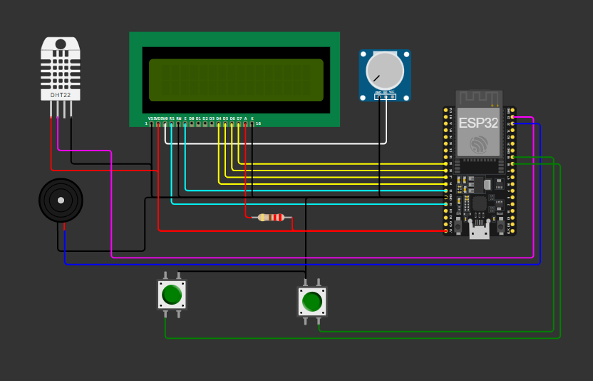

# Projeto simples para controle de temperatura e umidade em um ambiente.
O circuito consiste no sensor de temperatura e umidade DHT (Digital Humidity
and Temperature), modelo 22 para simulação e 11 para o real. Este sensor realiza a
leitura do ambiente em sinal analógico, converte para um sinal digital (ou seja, zeros
e uns) e envia para a porta 23 do Esp32. No Esp32, o processamento dos dados é
realizado através das funções na biblioteca DHT.h fornecida pelo fabricante Adafruit.
As informações processadas são então exibidas no display. Por padrão, o display
mostra a umidade relativa (%) na linha 1 e a temperatura em Celsius na linha 2. O
modo de exibição pode ser trocado ao apertar o botão modo, onde alterna a exibição
para umidade absoluta em grama por metro cúbico (g/m³) e a temperatura para
Fahrenheit.

Além disso, no display é ligado um resistor de 220 Ω no Anodo do LED
responsável pelo brilho. Isso garante que a tensão seja entregue no limite ideal para
o seu funcionamento. Também é conectado um potenciômetro de 50 KΩ para controle
do contraste do display. Isso assegura que as informações sejam legíveis.
Conhecendo a posição do potenciômetro e sua resistência ideal para que o contraste
deixe as informações úteis, pode-se deixar um resistor de valor fixo.

O sensor fica lendo a umidade e temperatura do ambiente, e caso a
temperatura fique abaixo de 15 °C ou acima de 30 °C ou a umidade relativa acima de
70% o Buzzer é acionado fica em alerta, e uma mensagem é exibida no display como
ALERTA: Condições fora do Padrão, fica nesse alerta até que as condições do
ambiente normalize ou alguém aperte o botão mutar, esse botão silencia o buzzer e
tira da tela a mensagem de alerta por uns 30 segundos (O que foi usado para testes
do protótipo), se nesse tempo as condições não foram normalizadas, o alerta inicia
novamente.

## Esquema de Ligação
1. Sensor de Temperatura e Umidade DHT11/22: Conectado conforme segue:
- Pino 1 (alimentação) ligado a 5VDC.
- Pino 2 (sinal) conectado à porta 23 do ESP32.
- pino 4 (terra) conectado ao GND.
2. Buzzer Passivo: Conexões realizadas da seguinte maneira:
- Pino 1 ligado ao GND.
- Pino 2 conectado à porta 22 do ESP32.
3. Display de Cristal Líquido 16x2: Ligado da seguinte forma:
- Pino VSS (terra) conectado ao GND.
- Pino VDD (alimentação) ligado a 5VDC.
- Pino Vo (controle de contraste) ligado ao potenciômetro.
- Pino RS conectado à porta 13 do ESP32.
- Pino En conectado à porta 12.
- Pinos D4 a D7 conectados às portas 14, 27, 26 e 25, respectivamente.
- Pino A (Anodo) ligado a um resistor de 220 Ohms, que por sua vez está
conectado a 5VDC.
- Pino K (Catodo) ligado ao GND.
4. Potenciômetro: Responsável pelo controle de contraste do display.
5. Resistor 220 ohms: Ligado ao 5VDC, controle do led do display.
6. Botão de Pressão para Alterar Modo de Exibição: Conectado à porta 18 do
ESP32.
7. Botão de Pressão para Silenciar o Alarme: Ligado à porta 19 do ESP32



## Código Fonte 
```cpp
#include <DHT.h>            // Inclui a biblioteca das funções responsável pelo sensor de temperatura e umidade DHT(11/22)
#include <LiquidCrystal.h>  // Inclui a biblioteca responsável pela configuração do display LCD 16x2

// Define a pinagem de ajuste e configuração do display LCD
const byte lcdRS = 13, lcdEn = 12, lcdD4 = 14, lcdD5 = 27, lcdD6 = 26, lcdD7 = 25;

// Define a pinagem dos botões, sensor DHT e Buzzer 
const byte buttonMode = 18, buttonMute = 19, sensorDHT = 23, buzzer = 22;

// Define as constantes de controle de temperatura e umidade para armazenamento de medicamentos de acordo com a ANVISA
const float tempMin = 15.0, tempMax = 30.0, humMax = 70.0;

// Define as variáveis para salvar a temperatura e umidade lida pelo sensor
float temperature = 0, humidity = 0;

// Variável para controlar o modo de exibição de temperatura (Celsius ou Fahrenheit)
volatile bool showInFahrenheit = false;

// Variável para controlar o estado do alarme
volatile bool alarmMuted = false;

// Define o modelo de sensor DHT como DHT11 ou DHT22 (Descomente a que for usar)
const byte DHTTYPE = DHT11;
// const byte DHTTYPE = DHT22;

// Inicia o objeto para o sensor de temperatura e umidade DHT
DHT dht(sensorDHT, DHTTYPE);

// Inicia o objeto LiquidCrystal para comunicação com o LCD
LiquidCrystal lcd(lcdRS, lcdEn, lcdD4, lcdD5, lcdD6, lcdD7);

// Função para ler dados do sensor de temperatura e umidade
void readSensorDHT() {
  humidity = dht.readHumidity();      // Lê a umidade do sensor
  temperature = dht.readTemperature();// Lê a temperatura do sensor
  // Verifica se a leitura falhou e exibe uma mensagem de erro no LCD
  if (isnan(temperature) || isnan(humidity)) {
    lcd.clear();
    lcd.setCursor(0, 0);
    lcd.println("Falha ao ler DHT");
    delay(1000); // Espera 1 segundo antes de tentar ler novamente
  }
}

// Função para calcular a umidade absoluta em g/m³
float calculateAbsoluteHumidity() {
  // Cálculo da pressão de vapor de água
  float es = 6.112 * exp((17.67 * temperature) / (temperature + 243.5));
  // Cálculo da pressão de vapor atual
  float ea = (humidity / 100.0) * es;
  // Cálculo da umidade absoluta
  float ah = (216.7 * ea) / (temperature + 273.15);
  return ah;
}

// Função para calcular a temperatura em Fahrenheit
float calcularTempFahrenheit() {
  return temperature * 9.0 / 5.0 + 32.0; // Converte Celsius para Fahrenheit
}

// Função de interrupção para alternar entre Celsius e Fahrenheit
void IRAM_ATTR toggleTemperatureMode() {
  showInFahrenheit = !showInFahrenheit; // Alterna o modo de exibição de temperatura
}

// Função de interrupção para desativar temporariamente o alarme
void IRAM_ATTR muteAlarm() {
  alarmMuted = true; // Ativa o modo mudo do alarme
}

// Função para mostrar os dados de temperatura e umidade no display LCD
void lcdViewer() {
  lcd.clear(); // Limpa o display
  if (showInFahrenheit) {
    // Exibe a umidade absoluta e a temperatura em Fahrenheit
    lcd.setCursor(0, 0);
    lcd.print("AH: ");
    lcd.print(calculateAbsoluteHumidity());
    lcd.print(" g/m3");
    lcd.setCursor(0, 1);
    lcd.print("Temp: ");
    lcd.print(calcularTempFahrenheit());
    lcd.print(" F");
  } else {
    // Exibe a umidade relativa e a temperatura em Celsius
    lcd.setCursor(0, 0);
    lcd.print("Umid: ");
    lcd.print(humidity);
    lcd.print(" %");
    lcd.setCursor(0, 1);
    lcd.print("Temp: ");
    lcd.print(temperature);
    lcd.print(" C");
  }
}

// Função do alarme e controle do temporizador
void alertAndTimer() {
  static unsigned long muteStart = 0; // Armazena o tempo de início do mute
  static bool timerActive = false;    // Indica se o temporizador está ativo

  // Verifica se a temperatura ou umidade estão fora dos limites
  if (temperature < tempMin || temperature > tempMax || humidity > humMax) {
    if (!alarmMuted) {
      // Se o alarme não está silenciado, exibe a mensagem de alerta e toca o buzzer
      lcd.clear();
      lcd.setCursor(0, 0);
      lcd.print("ALERTA:");
      lcd.setCursor(0, 1);
      lcd.print("Cond. fora do padrao");
      tone(buzzer, (millis() / 500) % 2 == 0 ? 1000 : 1500); // Alterna a frequência do buzzer
    } else {
      // Se o alarme está silenciado, inicia o temporizador
      if (!timerActive) {
        muteStart = millis(); // Registra o tempo de início do mute
        timerActive = true;
        noTone(buzzer);  // Garante que o buzzer fique silencioso quando mute
      }
      // Verifica se o mute ainda está dentro do período de 30 segundos
      if (millis() - muteStart < 30000) {
        readSensorDHT(); // Lê os dados do sensor
        lcdViewer();     // Atualiza o display LCD
        delay(500);      // Aguarda 500ms antes de ler novamente
        // Verifica se as condições voltaram ao normal
        if (!(temperature < tempMin || temperature > tempMax || humidity > humMax)) {
          alarmMuted = false; // Desativa o mute se as condições estiverem normais
          timerActive = false;
        }
      } else {
        // Desativa o mute e o temporizador após 30 segundos
        alarmMuted = false;
        timerActive = false;
      }
    }
  } else {
    noTone(buzzer); // Garante que o buzzer fique silencioso se as condições estiverem normais
  }
}

// Função de configuração principal
void setup() {
  dht.begin();         // Inicia o sensor DHT
  lcd.begin(16, 2);    // Inicializa o display LCD 16x2
  Serial.begin(9600);  // Inicia a comunicação serial com 9600 bps

  // Configura os botões com resistor de pull-up interno
  pinMode(buttonMode, INPUT_PULLUP);
  pinMode(buttonMute, INPUT_PULLUP);
  pinMode(buzzer, OUTPUT);
  digitalWrite(buzzer, LOW); // Garante que o buzzer esteja desligado inicialmente

  // Configura as interrupções para os botões
  attachInterrupt(digitalPinToInterrupt(buttonMode), toggleTemperatureMode, FALLING);
  attachInterrupt(digitalPinToInterrupt(buttonMute), muteAlarm, FALLING);

  // Mostra a mensagem inicial no LCD
  lcd.clear();
  lcd.setCursor(0, 0);
  lcd.print("TCASTROCNA");
  lcd.setCursor(0, 1);
  lcd.print("Carregando ...");
  delay(2000); // Aguarda 2 segundos

  // Loop principal no setup
  while (true) {
    readSensorDHT(); // Lê os dados do sensor
    lcdViewer();     // Atualiza o display LCD
    alertAndTimer(); // Verifica e controla o alarme
    delay(500);      // Aguarda 500ms antes de ler novamente
  }
}

// Função principal do loop do Arduino (vazia)
void loop() {}
```
