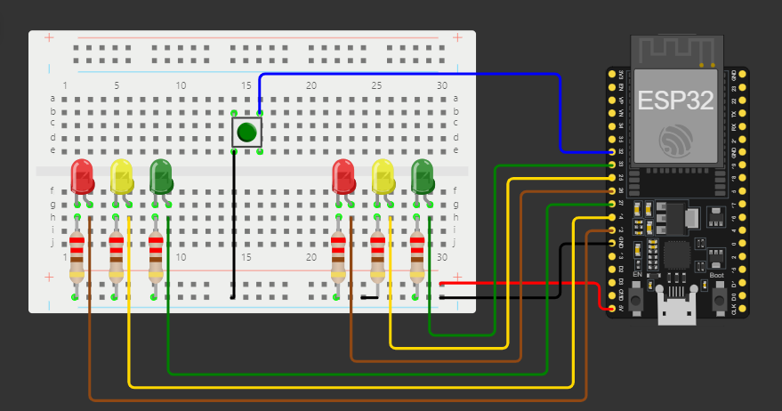

## Semáforo Simples com modo intermitente utilizando ESP32.
Em algumas cidades os semáforos entram em alerta durante a madrugada, ou seja, apenas os leds na cor amarela ficam piscando fazendo com que o motorista preste apenas atenção ao cruzar, esse método é utilizado em cidades com pouco ou quase sem nenhum trânsito na madrugada, isso evita o motorista ficar parado no sinal e ser assaltado por exemplo. E este é um projeto simples para simular esta situação seja para fazer apenas por diversão ou educação, consite em quando o botão físico for desativado o semáforo entra em modo alerta, ao botão ser ativado o sinal funcionará normalmente.

## Esquema de montagem


## Código Fonte
```cpp
#include <Arduino.h>

// Define as portas dos LEDs no ESP32
// Semáforo 1
const int ledVermelho1 = 12; // LED vermelho (Pare)
const int ledAmarelo1 = 14; // LED Amarelo (Atenção)
const int ledVerde1 = 27; // LED Verde (Siga)

// Semáforo 2
const int ledVermelho2 = 26; // LED vermelho (Pare)
const int ledAmarelo2 = 25; // LED Amarelo (Atenção)
const int ledVerde2 = 33; // LED Verde (Siga)

// Botão para ativar/desativar modo intermitente
const int botao = 32; // Porta do botão

// Variável de estado do modo intermitente
volatile bool modoIntermitente = false;
volatile unsigned long ultimaTrocaModo = 0; // Para debounce
const unsigned long debounceDelay = 1000; // Tempo de debounce (em milissegundos)

// Função de configuração principal
void setup() {
  // Configura as portas como saídas
  // Semáforo 1
  pinMode(ledVermelho1, OUTPUT);
  pinMode(ledAmarelo1, OUTPUT);
  pinMode(ledVerde1, OUTPUT);

  // Semáforo 2
  pinMode(ledVermelho2, OUTPUT);
  pinMode(ledAmarelo2, OUTPUT);
  pinMode(ledVerde2, OUTPUT);

  // Configura a porta do botão como entrada com pullup interno
  pinMode(botao, INPUT_PULLUP);

  // Configura a interrupção no botão
  attachInterrupt(digitalPinToInterrupt(botao), mudarModo, FALLING);
}

// Função de loop principal
void loop() {
  if (modoIntermitente) {
    // Modo intermitente: pisca os LEDs amarelos
    digitalWrite(ledAmarelo1, HIGH);
    digitalWrite(ledAmarelo2, HIGH);
    delay(500);
    digitalWrite(ledAmarelo1, LOW);
    digitalWrite(ledAmarelo2, LOW);
    delay(500);
  } else {
    // Modo normal: sequência dos semáforos
    // Liga led vermelho do semáforo 1
    digitalWrite(ledVermelho1, HIGH);
    digitalWrite(ledAmarelo1, LOW);
    digitalWrite(ledVerde1, LOW);

    delay(1000); // Espera 1 segundo

    // Liga led verde do semáforo 2
    digitalWrite(ledVermelho2, LOW);
    digitalWrite(ledAmarelo2, LOW);
    digitalWrite(ledVerde2, HIGH);

    delay(5000); // Espera 5 segundos

    // Liga led amarelo do semáforo 2
    digitalWrite(ledVermelho2, LOW);
    digitalWrite(ledAmarelo2, HIGH);
    digitalWrite(ledVerde2, LOW);

    delay(2000); // Espera 2 segundos

    // Liga led vermelho do semáforo 2
    digitalWrite(ledVermelho2, HIGH);
    digitalWrite(ledAmarelo2, LOW);
    digitalWrite(ledVerde2, LOW);

    delay(1000); // Espera 1 segundo

    // Liga led verde do semáforo 1
    digitalWrite(ledVermelho1, LOW);
    digitalWrite(ledAmarelo1, LOW);
    digitalWrite(ledVerde1, HIGH);

    delay(5000); // Espera 5 segundos

    // Liga led amarelo do semáforo 1
    digitalWrite(ledVermelho1, LOW);
    digitalWrite(ledAmarelo1, HIGH);
    digitalWrite(ledVerde1, LOW);

    delay(2000); // Espera 2 segundos
  }
}

// Função de interrupção para mudar o modo
void mudarModo() {
  // Verifica se já passou o tempo de debounce
  unsigned long tempoAtual = millis();
  if (tempoAtual - ultimaTrocaModo > debounceDelay) {
    modoIntermitente = !modoIntermitente;
    ultimaTrocaModo = tempoAtual;
  }
}

```
